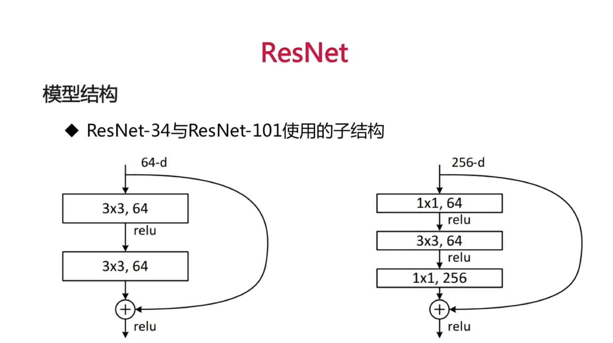
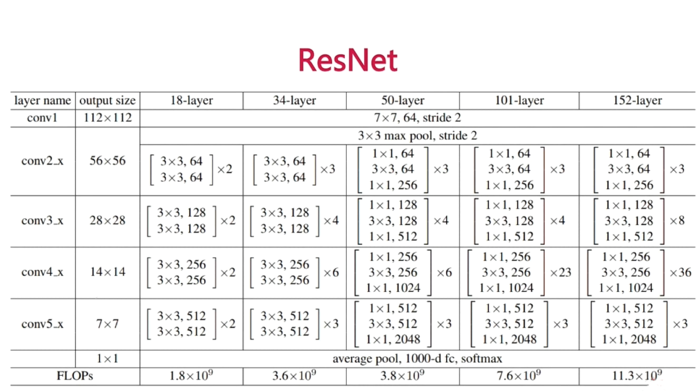
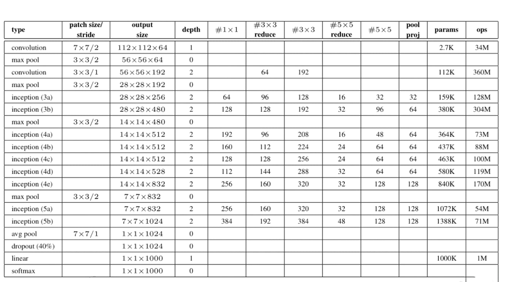
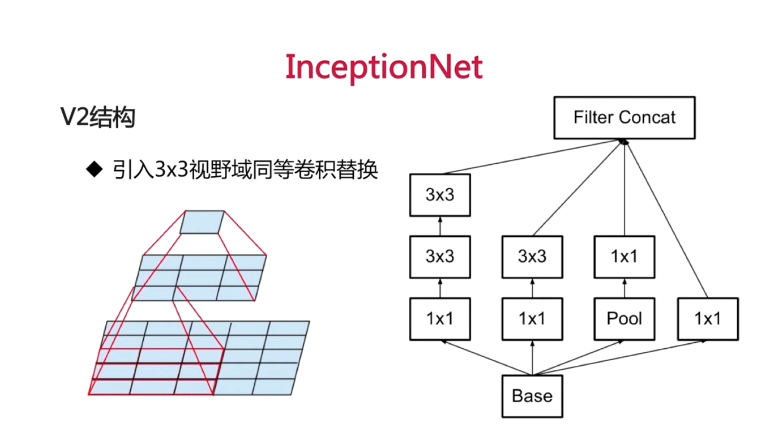
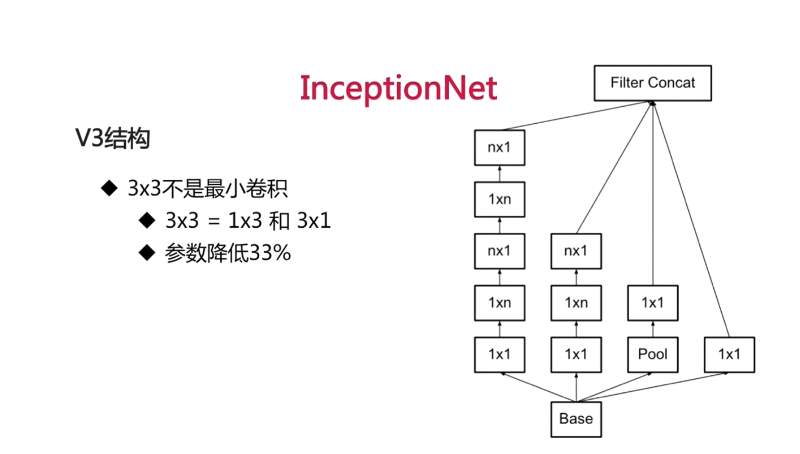
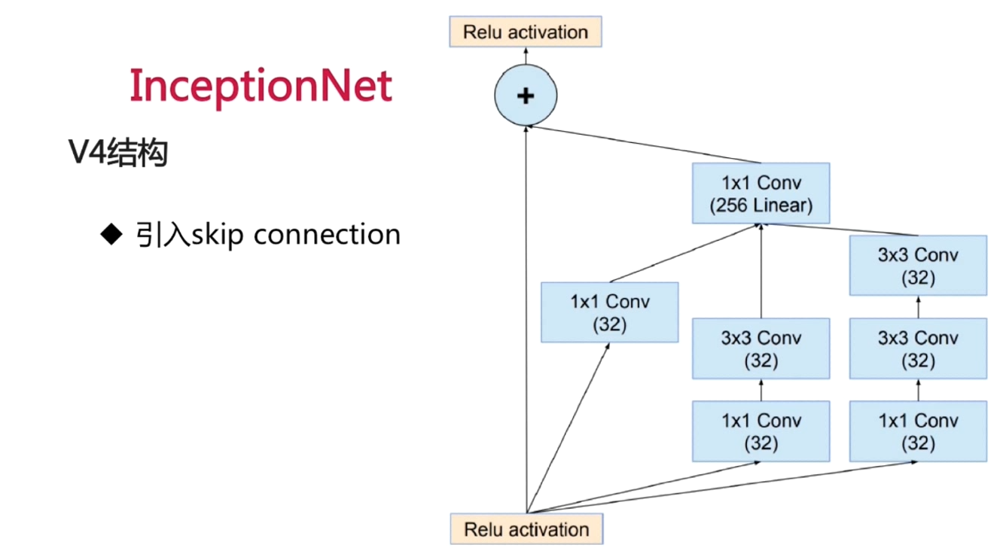
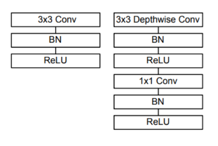
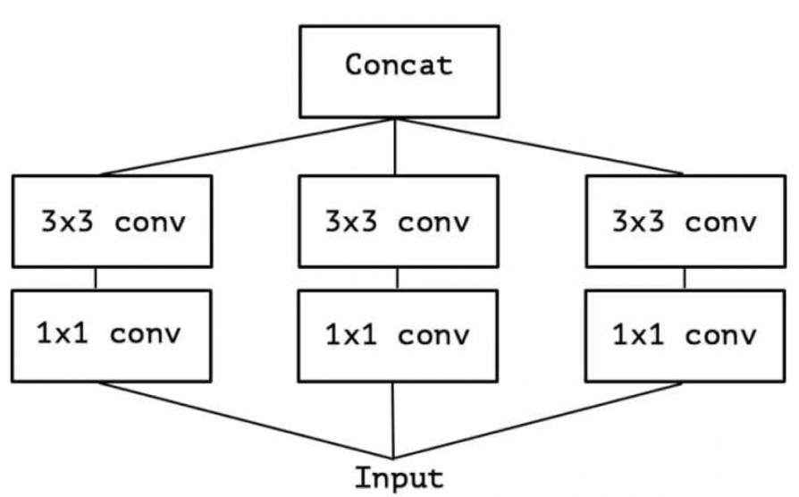

# Image classification
This project contains various CNN for image classification.
## Dataset
cifar-10
## Alex-net

论文：《ImageNet Classification with Deep Convolutional Neural Networks》   
意义：相比传统结构有了更高的分类准确度，引爆深度学习，首次使用Relu。   
结构：2-GPU并行结构；1、2、5卷积层后跟随max-pooling层；两个全连接使用dropout；总共8层神经网络。
## Vgg-net
论文：《Very Deep Convolutional Networks for Large-Scale Image Recognition》    
意义：分类问题第二，物体检测第一(ImageNet2014)。  
结构：更深的网络结构；使用3x3的卷积核和1x1的卷积核；每经过一个pooling层，通道数目翻倍。
两个3x3卷积层视野率等于一个5x5卷积核，多一次线性变换且参数数量降低28%，1x1的卷积核可以看做在对应通道上的非线性变换，有通道降维的作用。  

## Res-net

## Inception-net

### V1

### V2

### V3

### V4

## Mobile-net

## cnn tricks

